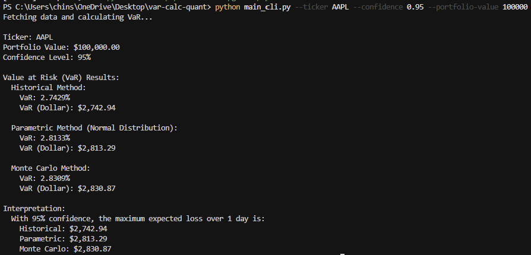
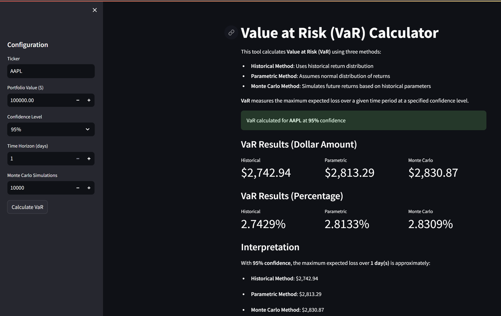
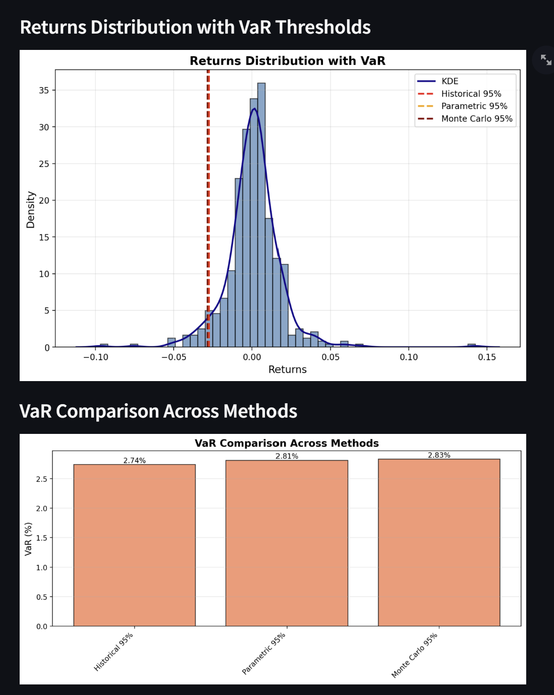
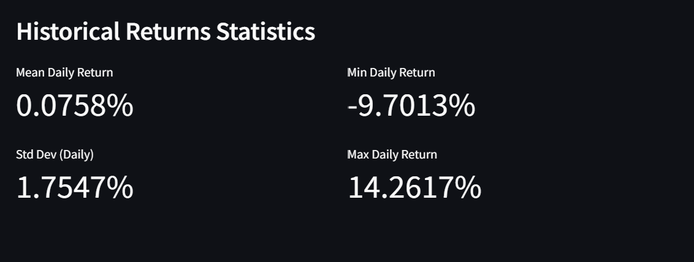

## Value at Risk (VaR) Calculator

> **Part of 5-Project Quantitative Finance Portfolio Series**
> 
> **Week 2 of 5** | [View All Projects](#project-series)

Professional-grade **Value at Risk (VaR)** calculation tool implementing three industry-standard methodologies:

- **Historical Method**: Non-parametric approach using empirical return distribution
- **Parametric Method** (Variance-Covariance): Assumes normal distribution of returns
- **Monte Carlo Simulation**: Generates future scenarios based on historical parameters

Provides both a **command-line interface (CLI)** and an **interactive Streamlit UI** for risk analysis.

---

## What is Value at Risk (VaR)?

**VaR** is a statistical measure used in risk management to quantify the level of financial risk within a portfolio over a specific time frame. 

For example, a **1-day VaR of $10,000 at 95% confidence** means:
- There is a 95% probability that losses will not exceed $10,000 over the next day
- Or equivalently, there is a 5% chance losses could be greater than $10,000

VaR is widely used by banks, hedge funds, and financial institutions for risk assessment and regulatory compliance.

---

## 1. Setup

From the project root (`var-calc-quant`):

```bash
python -m venv .venv
# On PowerShell
.venv\Scripts\Activate.ps1

pip install -r requirements.txt
```

---

## 2. CLI Usage

Run VaR calculations from the terminal:

```bash
python main_cli.py --ticker AAPL --confidence 0.95 --portfolio-value 100000 --time-horizon 1 --mc-simulations 10000
```

### Parameters

- **`--ticker`**: Stock ticker symbol (default: `AAPL`)
- **`--confidence`**: Confidence level as decimal (default: `0.95` for 95%)
- **`--portfolio-value`**: Portfolio value in dollars (default: `100000`)
- **`--time-horizon`**: Time horizon in days (default: `1`)
- **`--mc-simulations`**: Number of Monte Carlo simulations (default: `10000`)

### Example Output

```text
Ticker: AAPL
Portfolio Value: $100,000.00
Confidence Level: 95%

Value at Risk (VaR) Results:
  Historical Method:
    VaR: 2.1234%
    VaR (Dollar): $2,123.40

  Parametric Method (Normal Distribution):
    VaR: 2.0156%
    VaR (Dollar): $2,015.60

  Monte Carlo Method:
    VaR: 2.1089%
    VaR (Dollar): $2,108.90

Interpretation:
  With 95% confidence, the maximum expected loss over 1 day is:
    Historical: $2,123.40
    Parametric: $2,015.60
    Monte Carlo: $2,108.90
```

### CLI Screenshot



The CLI displays VaR calculations using all three methods with both percentage and dollar values, along with a clear interpretation of the results.

---

## 3. Streamlit UI

Start the interactive web interface:

```bash
streamlit run app_streamlit.py
```

### Features

In the sidebar, configure:
- **Ticker** symbol
- **Portfolio value** in dollars
- **Confidence level** (90%, 95%, 99%)
- **Time horizon** (1-30 days)
- **Monte Carlo simulations** count

The app displays:
- **VaR values** for all three methods (both percentage and dollar amounts)
- **Returns distribution histogram** with VaR thresholds overlaid
- **Bar chart comparison** of VaR across methods
- **Statistical summary** of historical returns (mean, std dev, min, max)

### UI Screenshots

**Main Dashboard with VaR Results**



Configure settings in the sidebar, then view VaR calculations for all three methods with both percentage and dollar amounts, plus interpretation.

**Returns Distribution and VaR Comparison**



Visualize the historical returns distribution with VaR thresholds overlaid (top), and compare VaR values across methods in a bar chart (bottom).

**Historical Returns Statistics**



View detailed statistics of the historical returns including mean, standard deviation, minimum, and maximum daily returns.

---

## 4. Project Structure

```text
var-calc-quant/
├─ requirements.txt        # Python dependencies
├─ README.md               # This file
├─ images/                 # App screenshots
├─ src/
│  ├─ __init__.py          # Package init
│  ├─ config.py            # Default configuration
│  ├─ data_fetcher.py      # yfinance data download
│  ├─ returns.py           # Return calculations
│  ├─ var_methods.py       # VaR calculation methods
│  ├─ portfolio.py         # Portfolio-level calculations
│  ├─ visualizations.py    # Plotting utilities
│  └─ pipeline.py          # End-to-end VaR pipeline
├─ main_cli.py             # CLI entry point
└─ app_streamlit.py        # Streamlit UI
```

---

## 5. VaR Methods Explained

### Historical Method
- Uses actual historical returns to construct the empirical distribution
- No assumptions about distribution shape
- VaR is the percentile corresponding to the confidence level
- **Pros**: No distributional assumptions
- **Cons**: Limited by historical data; may not reflect future tail risk

### Parametric Method (Variance-Covariance)
- Assumes returns follow a normal (Gaussian) distribution
- Calculates VaR using mean and standard deviation
- Formula: `VaR = -(μ - z * σ)` where z is the z-score for confidence level
- **Pros**: Simple, fast, analytically tractable
- **Cons**: Assumes normality; underestimates tail risk if returns have fat tails

### Monte Carlo Simulation
- Simulates thousands of potential future return scenarios
- Uses historical mean and volatility as parameters for random sampling
- VaR is the percentile of simulated outcomes
- **Pros**: Flexible, can model complex scenarios
- **Cons**: Computationally intensive; still relies on historical parameters

---

## 6. Use Cases & Extensions

### For Quant Interviews
This project demonstrates understanding of:
- Risk management fundamentals
- Statistical methods in finance
- Monte Carlo simulation
- Financial data handling with Python
- Production-ready code structure

### Potential Extensions
- **Multi-asset portfolios**: Calculate portfolio VaR with correlation matrices
- **Conditional VaR (CVaR)**: Expected shortfall beyond VaR threshold
- **Stress testing**: Custom scenario analysis
- **Backtesting**: Validate VaR model accuracy over historical periods
- **GARCH models**: Time-varying volatility estimation
- **Non-normal distributions**: Student's t, skewed distributions
- **Risk-adjusted returns**: Sharpe ratio, Sortino ratio integration

---

## 7. References & Further Reading

- [RiskMetrics Technical Document (J.P. Morgan)](https://www.msci.com/documents/10199/5915b101-4206-4ba0-aee2-3449d5c7e95a)
- [Value at Risk (VaR) - Investopedia](https://www.investopedia.com/terms/v/var.asp)
- [Basel Committee on Banking Supervision - Market Risk Framework](https://www.bis.org/bcbs/publ/d352.htm)

---

## Project Series

This project is **Week 2** of a 5-project quantitative finance portfolio series:

1. **Week 1: Stock Price Prediction with Linear Regression**  
   [https://github.com/shaoyangchin/linear-reg-quant](https://github.com/shaoyangchin/linear-reg-quant)

2. **Week 2: Value at Risk (VaR) Calculator** (This Project)  
   [https://github.com/shaoyangchin/var-calc-quant](https://github.com/shaoyangchin/var-calc-quant)

3. **Week 3: Monte Carlo Options Pricing Simulator**  
   [https://github.com/shaoyangchin/monte-carlo-sim-options-quant](https://github.com/shaoyangchin/monte-carlo-sim-options-quant)

4. **Week 4: Pairs Trading Strategy Backtest**  
   [https://github.com/shaoyangchin/pair-trade-strat-quant](https://github.com/shaoyangchin/pair-trade-strat-quant)

5. **Week 5: Portfolio Optimization Tool**  
   [https://github.com/shaoyangchin/portfolio-optimization-tool-quant](https://github.com/shaoyangchin/portfolio-optimization-tool-quant)

---
